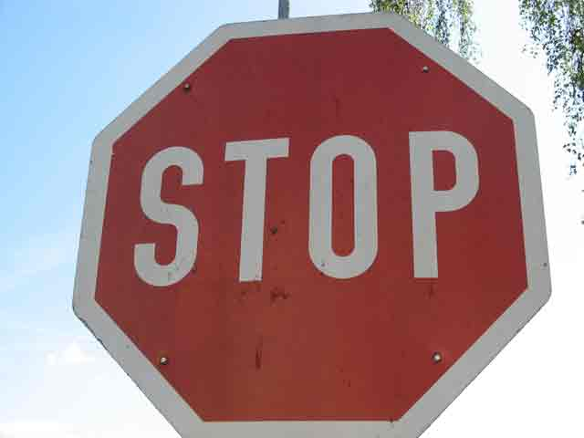

# **Traffic Sign Recognition**

---

**Build a Traffic Sign Recognition Project**

The goals / steps of this project are the following:
* Load the data set (see below for links to the project data set)
* Explore, summarize and visualize the data set
* Design, train and test a model architecture
* Use the model to make predictions on new images
* Analyze the softmax probabilities of the new images
* Summarize the results with a written report

---

#### 1. Provide a Writeup / README that includes all the rubric points and how you addressed each one. You can submit your writeup as markdown or pdf. You can use this template as a guide for writing the report. The submission includes the project code.

You're reading it! and here is a link to my [project notebook](./Traffic_Sign_Classifier.ipynb)

### Data Set Summary & Exploration

#### 1. Provide a basic summary of the data set and identify where in your code the summary was done. In the code, the analysis should be done using python, numpy and/or pandas methods rather than hardcoding results manually.

The code for this step is contained in the **second** code cell of the IPython notebook.  

I used the pandas library to calculate summary statistics of the traffic
signs data set:

* The size of training set is **34799**
* The size of test set is **12630**
* The shape of a traffic sign image is **(32,32,3))**
* The number of unique classes/labels in the data set is **43**

#### 2. Include an exploratory visualization of the dataset and identify where the code is in your code file.

The code for this step is contained in the **third** code cell of the IPython notebook.  

Here is an exploratory visualization of the data set. It is a **histogram** showing how the data:

### Design and Test a Model Architecture

#### 1. Describe how, and identify where in your code, you preprocessed the image data. What tecniques were chosen and why did you choose these techniques? Consider including images showing the output of each preprocessing technique. Pre-processing refers to techniques such as converting to grayscale, normalization, etc.

The code for this step is contained in the fourth code cell of the IPython notebook.

I **shuffled** the dataset and applied a simple normalization to the input data which scaled the X_train and X_test values from [0:255] to **[0.1:0.9]** interval.

#### 2. Describe how, and identify where in your code, you set up training, validation and testing data. How much data was in each set? Explain what techniques were used to split the data into these sets. (OPTIONAL: As described in the "Stand Out Suggestions" part of the rubric, if you generated additional data for training, describe why you decided to generate additional data, how you generated the data, identify where in your code, and provide example images of the additional data)

The code for splitting the data into training and validation sets is already provided in the **first** code cell of the IPython notebook.  

My final training set had **34799** number of images. My validation set and test set had **4410** and **12630** number of images.

#### 3. Describe, and identify where in your code, what your final model architecture looks like including model type, layers, layer sizes, connectivity, etc.) Consider including a diagram and/or table describing the final model.

The code for my final model is located in the **fifth** cell of the ipython notebook.

My final model consisted of the following layers:

| Layer         		|     Description	        					|
|:---------------------:|:---------------------------------------------:|
| Input         		| 32x32x3 RGB image   							|
| Convolution 5x5     	| 1x1 stride, valid padding, outputs 28x28x6 	|
| RELU					|												|
| Max pooling	      	| 2x2 stride,  outputs 14x14x6 				|
| Convolution 5x5	    | 1x1 stride, valid padding, outputs 10x10x16      									|
| RELU					|												|
| Max pooling	      	| 2x2 stride,  outputs 5x5x16 				|
|	Flatten					|												|
| Fully connected		| Input: 400 Output: 120        									|
| RELU					|												|
| Fully connected		| Input: 120 Output: 84        									|
| RELU					|												|
| Fully connected		| Input: 84 Output: 43        									|
| Softmax				|        									|

#### 4. Describe how, and identify where in your code, you trained your model. The discussion can include the type of optimizer, the batch size, number of epochs and any hyperparameters such as learning rate.

The code for training the model is located in the **seventh** cell of the ipython notebook.

To train the model, I used a default cross entropy method, reduced mean (mean of elements across dimensions of a tensor) and Adam optimizer with rate 0.001.

#### 5. Describe the approach taken for finding a solution. Include in the discussion the results on the training, validation and test sets and where in the code these were calculated. Your approach may have been an iterative process, in which case, outline the steps you took to get to the final solution and why you chose those steps. Perhaps your solution involved an already well known implementation or architecture. In this case, discuss why you think the architecture is suitable for the current problem.

The code for calculating the accuracy of the model is located in the **sixth** cell of the Ipython notebook.

My final model results were:

First epoch training set accuracy of **0.740**

Highest validation set accuracy of **0.911**

Test set accuracy of **0.899**

The architecture from Nvidia's End to End Learning for Self-Driving Cars was first chosen.
The reason is that I have found this network pretty efficient in project 3.

However, it didn't perform well enough to utilize for traffic sign images if the images were scaled to 32x32. I believe the architecture could be proven effective if the images were in the original size.

Afterwards, LeNet architecture was thus chosen. The motivation is that LeNet was built for small size images like 32x32.

It's working pretty good actually. I didn't expect it to achieve almost perfect accuracy like other complicated network and LeNet was still able to give me around 90% accuracy in both training and testing stages.

### Test a Model on New Images

#### 1. Choose five German traffic signs found on the web and provide them in the report. For each image, discuss what quality or qualities might be difficult to classify.

Here are the five German traffic signs that I found on the web:

The first image must be difficult to classify because it is a new invented sign to remind people playing with cell phones.

The second, fourth and fifth shouldn't be hard since they exist in the dataset.

The third might be challenging because there are numbers within the sign.

#### 2. Discuss the model's predictions on these new traffic signs and compare the results to predicting on the test set. Identify where in your code predictions were made. At a minimum, discuss what the predictions were, the accuracy on these new predictions, and compare the accuracy to the accuracy on the test set (OPTIONAL: Discuss the results in more detail as described in the "Stand Out Suggestions" part of the rubric).

The code for making predictions on my final model is located in the **eleventh** cell of the Ipython notebook.

Here are the results of the prediction:

| Image			        |     Prediction	        					|
|:---------------------:|:---------------------------------------------:|
| Ground-Level Traffic Lights     			| Speed Limit (30km/h) 										|
| Road Work				| **Road Work**									|
| Steep Downgrade	      		| No passing for vehicles over 3				 				|
| Stop Sign      		| **Stop sign**   									|
| Watch for Children			| Slippery Road      							|

The model was able to correctly guess 4 of the 5 traffic signs, which gives an accuracy of 80%. This compares favorably to the accuracy on the test set of ...

#### 3. Describe how certain the model is when predicting on each of the five new images by looking at the softmax probabilities for each prediction and identify where in your code softmax probabilities were outputted. Provide the top 5 softmax probabilities for each image along with the sign type of each probability. (OPTIONAL: as described in the "Stand Out Suggestions" part of the rubric, visualizations can also be provided such as bar charts)

The code for making predictions on my final model is located in the **12th** and **13th** cell of the Ipython notebook.

For the Ground-Level Traffic Lights image, the model is relatively sure that this is a Speed Limit (30km/h) (probability of 0.755), yet that was incorrect. The top five soft max probabilities were

| Probability         	|     Prediction	        					|
|:---------------------:|:---------------------------------------------:|
| 0.755         			| Speed Limit (30km/h)   									|
| 0.21     				| Stop 										|
| 0.034					| Speed Limit (20km/h)  										|
| 0.01	      			| Bicycles crossing					 				|
| 0.00				    | Children crossing      							|

And the rest look like this:

